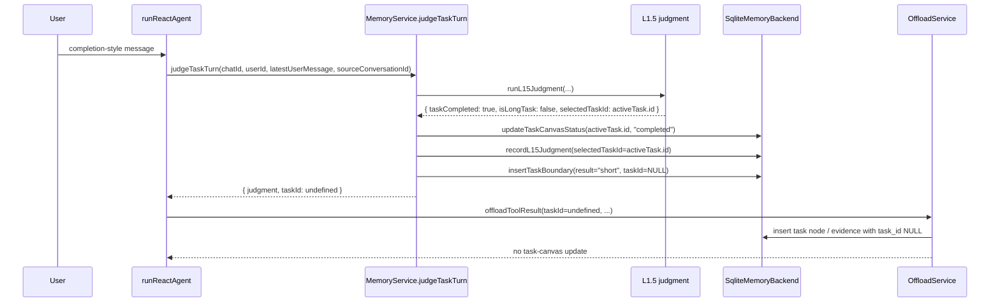

# Completion turn tool evidence loses task ownership

## Status

Confirmed by control-flow inspection and existing component tests.

## Summary

When an active task is explicitly completed, L1.5 keeps `selectedTaskId`, but `MemoryService.judgeTaskTurn()` only returns `taskId` for turns where `isLongTask` is true. If the assistant still executes tools on that completion turn, the tool result is persisted without task ownership.

## Reproduction path

1. Start with an active task canvas.
2. Send a completion-style user message such as `sudah selesai, tests passing`.
3. L1.5 returns a completion judgment with `taskCompleted: true`, `isLongTask: false`, and `selectedTaskId` set to the active task id.
4. `MemoryService.judgeTaskTurn()` marks the task completed and records the judgment, but returns `taskId: undefined` because the final return value is gated by `judgment.isLongTask`.
5. `runReactAgent()` forwards that undefined `taskId` into `memory.offloadToolResult(...)`.
6. `OffloadService` persists the resulting node/evidence as non-task-scoped work and skips task-canvas updates.

## Detailed flow

### Control flow

### Value flow

1. `runReactAgent()` logs the user message and gets `sourceConversationId`.
2. `judgeTaskTurn()` loads the active task and runs L1.5 judgment.
3. For a completion-style message, L1.5 returns:
   - `taskCompleted: true`
   - `isLongTask: false`
   - `isContinuation: false`
   - `selectedTaskId: activeTask.id`
4. `judgeTaskTurn()` copies `selectedTaskId` into local `taskId`, then marks the active task canvas as `completed`.
5. The same method records the judgment with `selectedTaskId = activeTask.id`.
6. The same method records a task boundary as short-only because the boundary write is also gated by `judgment.isLongTask`, so it stores `result = "short"` and no `taskId`.
7. The method then returns `taskId: undefined` because its final return value is `judgment.isLongTask ? taskId : undefined`.
8. If the turn still executes tools after that, `runReactAgent()` forwards the returned `undefined` task id into `memory.offloadToolResult(...)`.
9. `OffloadService` takes the no-task path:
   - node/evidence rows are written without task ownership
   - evidence status becomes `"mapped"`
   - task-canvas update exits early because `taskId` is missing
10. Result: the task is marked completed, but final completion-turn verification output is stored outside the task.

### Important scope note

This bug matters only when a completion turn still runs tools. If the user completes the task and no tool execution happens afterward, the task can still be marked completed without showing this persistence mismatch.

## Expected

Tool outputs produced while completing a task should stay attached to the just-completed task so final verification evidence lives with that task.

## Actual

- `memory_task_nodes.task_id` becomes `NULL`
- `memory_l1_evidence_entries.task_id` becomes `NULL`
- evidence status becomes `"mapped"` instead of `"pending"`
- the task canvas is not updated with completion-turn tool output
- downstream task recall and L4 draft-skill generation can miss final verification evidence

## Root cause

The flow uses two different meanings for task association:

- `selectedTaskId` tracks which task the turn belongs to
- returned `taskId` is gated by `judgment.isLongTask`

Completion turns keep the first value but drop the second.

## Evidence

- Completion judgments retain the active task id: `src/memory/offload/l15.ts:28-35`, `tests/memory/l15.test.ts:30-46`
- The return path drops `taskId` when `isLongTask` is false: `src/memory/core/service.ts:566-602`
- The live agent loop forwards the returned `taskId`: `src/agent/react-agent.ts:244-252`
- Offload with no `taskId` writes unscoped nodes/evidence and skips canvas updates: `src/memory/offload/service.ts:221-234`, `src/memory/offload/service.ts:293-300`, `tests/memory/offload.test.ts:26-139`
- L4 draft generation depends on a completed task canvas plus task-scoped nodes: `src/memory/core/service.ts:624-680`

## Notes

- This appears to affect completion turns that still trigger tool execution, such as verification or test-running after the user says the task is done.
- I did not find a dedicated end-to-end regression test for this exact path yet.

## Follow-up direction

Keep completion-turn tool results attached to the completed task, either by returning the completion `taskId` from `judgeTaskTurn()` or by explicitly forwarding `selectedTaskId` for completion turns.
